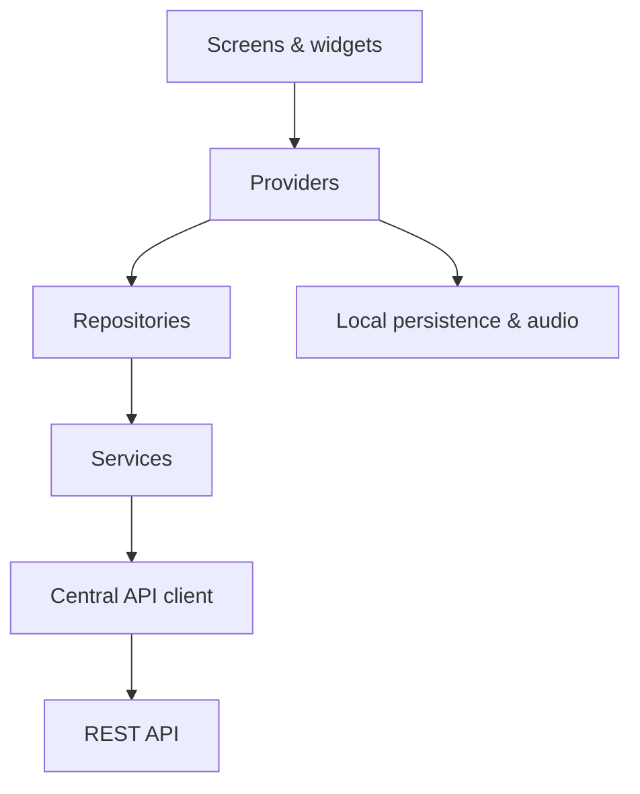
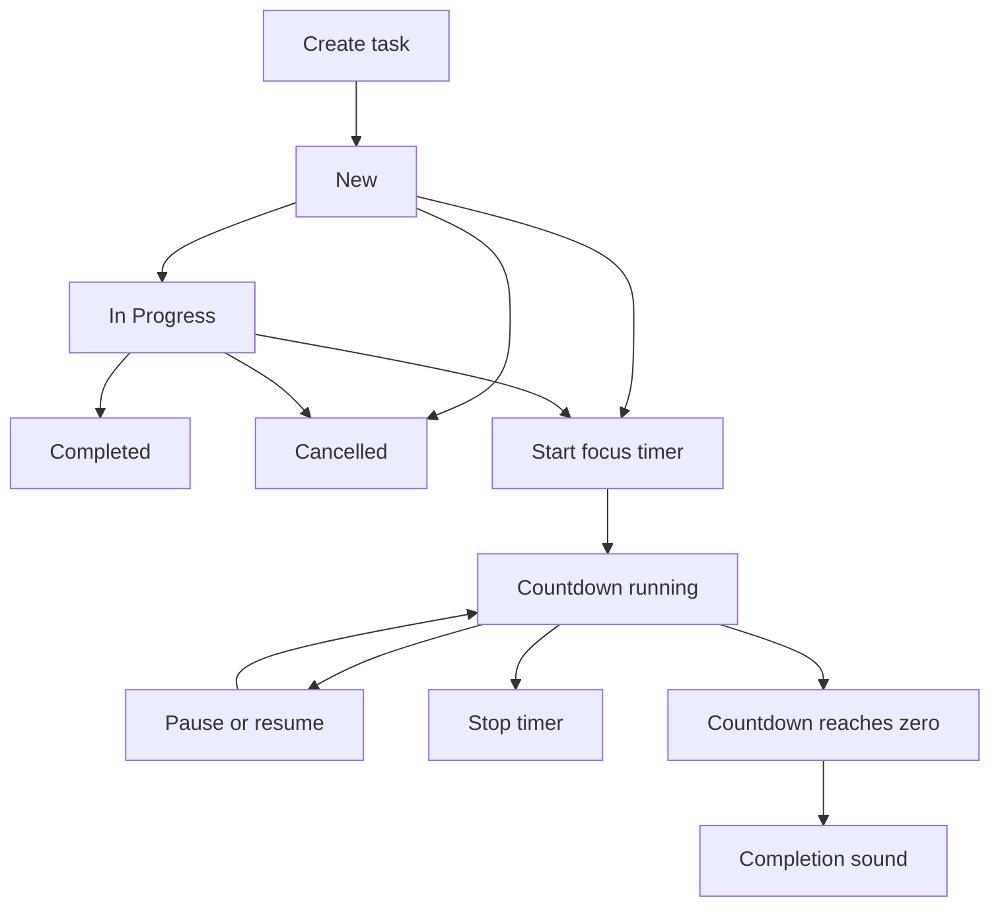

# TaskLane — Flutter Task Manager with REST API & Focus Timer

### TaskLane by SABBIR AHAMMED

> **Plan. Track. Complete.**

A fully branded Flutter productivity app for managing tasks through a clear, status-based workflow.


[](LICENSE)

## Overview

**TaskLane** is a production-grade Flutter task management application built with Dart, Provider state management, REST API integration, persistent authentication, profile management, and a task-linked focus timer.

The app supports the complete task lifecycle—**New**, **In Progress**, **Completed**, and **Cancelled**—through an API-backed dashboard and status-specific task views. Its modular Provider–Repository–Service architecture separates interface, state, data access, networking, local persistence, and audio playback responsibilities.

TaskLane uses its own visual identity, including custom SVG logos, illustrations, backgrounds, status icons, color system, typography, and branded interface components.

## ✨ Key Features

### Authentication and session management

- REST API registration and login
- Token-based authentication for protected requests
- Persistent login state using `shared_preferences`
- Automatic session routing from the branded splash screen
- Form validation and password visibility controls
- Confirmed logout with local session clearing
- Centralized handling for invalid responses, timeouts, offline errors, and unauthorized requests

### API-backed task management

- Create tasks with a title, description, and initial status
- Retrieve task lists by workflow status
- Move tasks between New, In Progress, Completed, and Cancelled
- Delete tasks through a confirmation flow
- Display live task totals for every status
- Pull to refresh task lists and dashboard data
- Task detail presentation with creation date and status-aware actions
- Independent loading, empty, and error states for each task category

### Focus timer

- Start a timer directly from a task card
- Quick presets for 15, 25, and 45 minutes, plus 1, 2, and 4 hours
- Custom durations from 1 minute up to 99 hours and 59 minutes
- Pause, resume, and stop controls
- Live `MM:SS` and `HH:MM:SS` countdown display
- Active timer visibility on task cards and the dashboard
- Timer state persistence across normal app restarts
- MP3 completion sound when the countdown reaches zero
- Automatic timer cleanup when its associated task is deleted

### Dashboard and navigation

- Personalized dashboard using the authenticated profile
- Four status summary cards with API-synchronized counts
- Recent task overview across task states
- Direct navigation from dashboard statistics to filtered task lists
- Bottom navigation for Home, Tasks, Add, and Profile

### Profile management

- Load authenticated profile details from the API
- Display name, email address, mobile number, and account date
- Edit and submit profile changes
- Refresh profile data after a successful update
- Pull-to-refresh and retry states

### Branded user experience

- Centralized light theme and TaskLane color system
- Responsive, keyboard-aware forms and bottom sheets
- Custom SVG logos, wordmarks, backgrounds, illustrations, and icons
- Reusable buttons, fields, headers, cards, loading states, and error states
- Status-specific colors and visual feedback
- Confirmation dialogs, progress indicators, validation messages, and snackbars

## 🧰 Technology Stack

| Technology | Role in TaskLane |
| --- | --- |
| Flutter | Cross-platform mobile UI framework |
| Dart | Application language |
| Provider | Reactive application state management |
| HTTP | REST API requests and JSON communication |
| SharedPreferences | Authentication and active-timer persistence |
| Flutter SVG | Rendering TaskLane's vector brand assets |
| AudioPlayers | Playing the timer completion sound |

TaskLane communicates with its backend through a REST API. Firebase is not used.

## 🧱 Architecture



- **Screens and widgets** render the interface and capture user actions.
- **Providers** own observable state, loading behavior, errors, and UI-facing operations.
- **Repositories** define the data-access boundary used by providers.
- **Services** coordinate authentication, tasks, profiles, timers, and audio.
- **ApiClient** centralizes headers, JSON encoding and decoding, timeouts, status handling, and exceptions.
- **Models** convert API and local JSON data into typed Dart objects.

## 📁 Project Structure

```text
lib/
├── app.dart
├── main.dart
├── core/
│   ├── constants/
│   ├── network/
│   ├── app_assets.dart
│   ├── app_colors.dart
│   └── app_theme.dart
├── models/
├── providers/
├── repositories/
├── services/
├── screens/
│   ├── auth/
│   ├── dashboard/
│   ├── profile/
│   └── task/
└── widgets/

assets/
├── audio/
│   └── timer_complete.mp3
└── images/
    ├── backgrounds/
    ├── branding/
    ├── icons/
    └── illustrations/
```

## 📱 Application Modules

| Module | Included screens and behavior |
| --- | --- |
| Authentication | Splash, login, registration, forgot password, OTP verification, and reset-password interfaces |
| Dashboard | Profile greeting, status totals, recent tasks, refresh, task actions, and active timer |
| Tasks | Status-filtered lists, task details, status transitions, deletion, and timer access |
| Create Task | Validated task creation with initial-status selection and success feedback |
| Profile | Profile details, edit profile, refresh, retry, and logout |

> The uploaded version connects registration and login to the REST API. The branded forgot-password, OTP, and reset-password screens are present at the UI layer; their submission actions remain an API-integration point.

## 🔌 Backend Integration

TaskLane communicates with a REST API through a centralized network client. The application includes authenticated requests, JSON serialization, response validation, timeout handling, and user-friendly error reporting.

For security and controlled access, this public README does not expose the production API base URL, endpoint paths, authentication-header format, request bodies, response schemas, credentials, or private backend documentation.

Authorized developers can configure the backend connection in:

```text
lib/core/constants/api_constants.dart
```

Any replacement backend must follow the data contracts expected by the existing models, repositories, and services.

## 🚀 Getting Started

### Prerequisites

- Flutter SDK and Dart SDK
- Android Studio or Visual Studio Code with Flutter tooling
- An Android emulator, iOS simulator, or supported physical device
- Network access to the configured TaskLane API

Verify your Flutter environment:

```bash
flutter doctor
```

### Installation

1. Clone the repository:

   ```bash
   git clone https://github.com/SABBIR-FOUNDER/tasklane-flutter-task-manager.git
   ```

2. Enter the project directory:

   ```bash
   cd tasklane-flutter-task-manager
   ```

3. Install the project dependencies:

   ```bash
   flutter pub get
   ```

4. Run TaskLane:

   ```bash
   flutter run
   ```

### Backend access

The backend URL and API contract are intentionally excluded from this public documentation. Authorized contributors should obtain the required configuration directly from the project owner and place it in `lib/core/constants/api_constants.dart`.

### Asset configuration

Keep the declared asset directories and completion sound available in `pubspec.yaml`. The audio path must match the actual filename exactly:

```yaml
flutter:
  assets:
    - assets/images/branding/
    - assets/images/backgrounds/
    - assets/images/illustrations/
    - assets/images/icons/
    - assets/audio/timer_complete.mp3
```

After changing dependencies or assets, refresh the build:

```bash
flutter clean
flutter pub get
flutter run
```

## ⏱️ Task and Timer Flow



Task state is synchronized with the REST API. Timer state is stored locally so an active or paused timer can be restored during a normal application restart.

## 🛡️ Security Considerations

- Passwords are not stored in `SharedPreferences`.
- The authentication token is attached only to requests marked as protected.
- Logout removes the locally stored authentication token.
- Request bodies use JSON with explicit `Content-Type` and `Accept` headers.
- Unauthorized responses are handled separately from general API failures.
- Sensitive credentials, private keys, and production secrets should never be committed to the repository.

The current implementation stores the authentication token in `SharedPreferences`. For high-sensitivity deployments, migrate token storage to a platform-backed secure storage solution.

## 🗺️ Roadmap

- [ ] Background timer-completion notifications when the app is closed
- [ ] Platform-backed secure token storage
- [ ] Offline task caching and synchronization
- [ ] Search, advanced filters, priority, and due-date support
- [ ] Unit, widget, and integration test coverage
- [ ] Accessibility review and localization

## 🤝 Contributing

Bug reports and well-scoped improvement proposals are welcome.

1. Fork the repository.
2. Create a focused feature branch.
3. Make and test your changes.
4. Run `flutter analyze`.
5. Open a pull request with a clear description of the change.

For major changes, open an issue first so the proposed behavior and API impact can be discussed.

## 👤 Author

**SABBIR AHAMMED**

- [GitHub — SABBIR-FOUNDER](https://github.com/SABBIR-FOUNDER)
- [LinkedIn — SABBIR AHAMMED](https://www.linkedin.com/in/sabbir911/)

## 📄 License, Attribution, and Brand Use

Copyright © 2026 SABBIR AHAMMED.

The source code is available under the [MIT License](LICENSE). It may be used, modified, distributed, sublicensed, or sold without requesting permission, provided the required copyright and license notices remain included in copies or substantial portions of the software.

The MIT License does not transfer the original authorship. Reuse must not falsely claim that the original TaskLane project was created by someone else.

The TaskLane name, logos, and visual identity identify the original project. The MIT License does not grant trademark rights or permission to present a modified version as the official TaskLane project or imply endorsement by its author. For brand usage, partnership, or commercial collaboration, contact SABBIR AHAMMED through the links above.

---

**TaskLane by SABBIR AHAMMED**  
*Plan. Track. Complete.*
